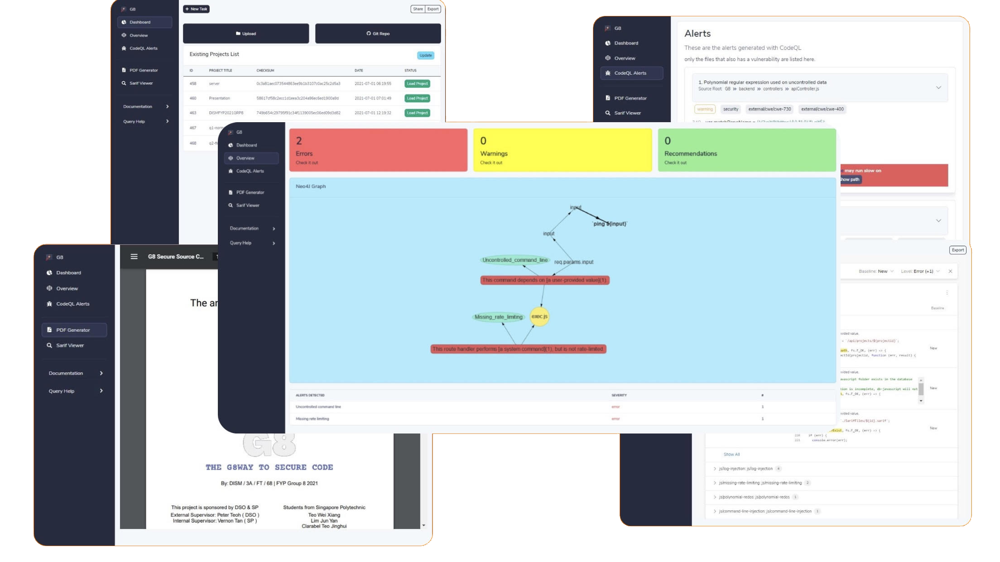

<br />
<p align="center">
  <a href="https://github.com/ISnackable/DISMFYP2021GRP8/">
    
  </a>

  <h3 align="center">DISMFYP2021GRP8</h3>

  <p align="center">
    FYP Project utilizing CodeQL for code analysis
    <br />
    <a href="https://github.com/ISnackable/DISMFYP2021GRP8/"><strong>Explore the docs »</strong></a>
    <br />
    <br />
    <a href="https://github.com/github/codeql">CodeQL</a>
    ·
    <a href="https://www.youtube.com/watch?v=Y6PjAaZKNYk">View Demo</a>
    ·
    <a href="https://neo4j.com/">Neo4J</a>
</p>

## Welcome

**DISMFYP2021GRP8**, also known as **G8**, is a static code scanning security tool designed with ReactJS and ExpressJS. It utilizes the CodeQL semantic code analysis engine to find all variants of a vulnerability. Below are some features of G8 but are not limited to.

### Features

- Uploading of project with folders, (_zipped_) files and Git repositories
- Alert results in a neat and concise page of CodeFlow
- Alert results visualization with Neo4J integration
- Interpret custom CodeQL queries
- Report generation for researcher
- Viewing custom SARIF file with [sarif-web-components](https://github.com/microsoft/sarif-web-component)
- Documentation of CodeQL queries

<br />



## Dependencies

The following tools should be installed before starting:

- [Docker](https://www.docker.com/get-started)

## Installation

Use the provided [docker configuration](docker-compose.yml) to deploy the project:

```shell
$ docker-compose up -d
```

Then, visit 127.0.0.1:3000, visit the dashboard page and upload a project you wish to analyze. Click analyze to begin the analysis and watch the magic unfold.

You can optionally edit the configuration file depending on your needs:

[Backend Configuration File](backend/config/index.js)

### Usage

To start trying out the project, follow the steps below.

1. Visit http://127.0.0.1:3000/#/dashboard/
2. Click on the `Git Repo` button and paste in https://github.com/ISnackable/DISMFYP2021GRP8.git
3. Click `Submit` to upload the project
4. Under the Existing Project table, click on `Start Analysis` and wait for the analysis to be done
5. Click `Load Project` and navigate to CodeQL Alert to view the results

## Development

### Getting Started

To get a local copy up and running follow these simple example steps.

### Prerequisites

Clone this repository on the latest version using git and update all submodules to the latest version.

```shell
$ git clone https://github.com/ISnackable/DISMFYP2021GRP8/ --recursive --depth 1
```

#### Install CodeQL CLI

1. [Download](https://github.com/github/codeql-cli-binaries/releases) the CodeQL CLI zip package.
2. Create a new CodeQL directory where you can place the CLI and any queries and libraries you want to use. For example, `D:/programs/codeql-home` or `/opt/codeql`.
3. Extract the zip archive in the CodeQL directory; `D:/programs/codeql-home/codeql`
4. Add CodeQL to Path.

   - Windows

     1. Go to `Control Panel\System and Security\System`
     2. Click on `Advance System Settings`
     3. Click on `Enviroment Variables`
     4. Edit `Path` for both User variables and System variables
     5. Click on `New` and add the CodeQL directory; `D:/programs/codeql-home/codeql`

   - Linux

     ```shell
     $ export PATH=/opt/codeql:$PATH
     ```

5. Verify your CodeQL CLI setup.

   ```shell
   $ codeql --help
   ```

6. Download & Install the [CodeQL VSCode Extension](https://marketplace.visualstudio.com/items?itemName=GitHub.vscode-codeql). (Optional)

#### Install MariaDB & Neo4J

##### Installation with Docker (Recommended)

- [Docker](https://www.docker.com/get-started)

```shell
$ docker run -p 3306:3306 -d -v backend/init.sql:/docker-entrypoint-initdb.d --env MYSQL_ROOT_PASSWORD=secret docker.io/library/mariadb:10
```

```shell
$ docker run -p 7474:7474 -p 7687:7687 -d -v $HOME/neo4j/data:/data --env NEO4J_AUTH=neo4j/s3cr3t neo4j:4.2.7
```

##### Install Manually

- [MariaDB](https://mariadb.org/download/)
- [Neo4J Community Edition](https://neo4j.com/download-center/#community)

1. Download & Install [MariaDB](https://mariadb.org/download/) on the latest version
2. Verify MariaDB is installed by running the following command

```shell
$ sudo service mysql status
```

3. Download & Install [Neo4J Community Server](https://neo4j.com/download-center/#community) on the latest version
4. Verify Neo4J is installed by visiting http://localhost:7474.

### Configuration

You can optionally edit the configuration file depending on your needs:

[Backend Configuration File](backend/config/index.js)

### Setup and start the frontend

```shell
$ cd frontend
$ yarn install
$ yarn start
```

### Setup and start the backend

```shell
$ cd backend
$ yarn install
$ yarn start
```

## License

The version of CodeQL used by the G8 is subject to the [CodeQL Research Terms & Conditions](https://securitylab.github.com/tools/codeql/license). 

By using G8, you agree to GitHub CodeQL Terms and Conditions. If you do not accept these Terms, do not download, install, use, or copy the Software.

## Acknowledgements

- [CodeQL](https://github.com/github/codeql)
- [CodeQL Logo](https://github.com/github/vscode-codeql/blob/main/extensions/ql-vscode/media/VS-marketplace-CodeQL-icon.png)
- [Themesberg Volt React Dashboard](https://github.com/themesberg/volt-react-dashboard)
- [Sarif Web Component](https://github.com/microsoft/sarif-web-component)
